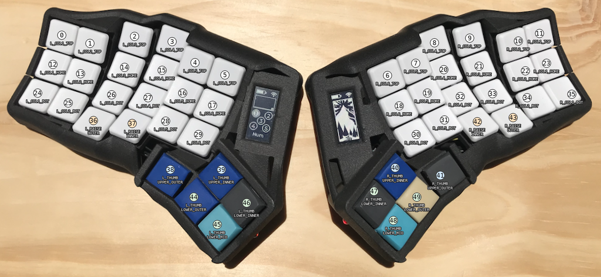
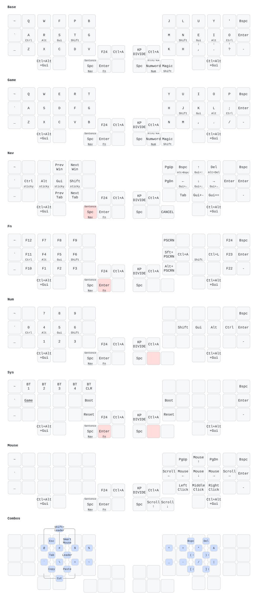
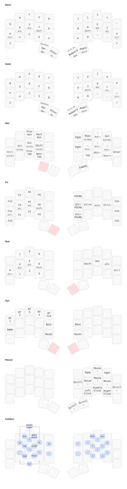

# My ZMK Config

Personal [ZMK firmware](https://github.com/zmkfirmware/zmk/) configuration based on [urob's zmk-config](https://github.com/urob/zmk-config). See urob's repository for detailed documentation on the keymap features, homerow mods configuration, and local build environment setup.

Daily driver: **Hillside D50** — a 50-key split dactyl with an optional Prospector dongle (Carrefinho status screens: Classic/Field/Operator/Radii). Legacy fallback: **Temper** (36 keys). The remaining keymaps in `config/` (glove80, corneish_zen, planck_rev6) are historical samples inherited from upstream.

## Hillside D50

Every keycap is stamped with its matrix position (0-49) and shared physical alias (`L_COL1_TOP` … `R_COL6_BOT`). These names are the common language for describing layout changes; the full layer, combo, and leader reference is in [docs/d50-map.md](docs/d50-map.md).

Generated references (`just draw-d50`, CI-checked):

- [draw/hillside_d50-positions.md](draw/hillside_d50-positions.md) — exhaustive position card: alias, legacy label, matrix cell, current binding.
- [draw/hillside_d50-positions.svg](draw/hillside_d50-positions.svg) — numbered physical map of the same data.

## Changes from upstream

This fork is customized for:

- **Hillside D50 (primary)** - 50-key split dactyl: 34-key core plus 16 extras, optional Prospector dongle with status screens, Hyper-3 window-manager keys, tmux prefix thumbs, and a shared physical key vocabulary
- **Temper keyboard** - legacy 36-key fallback with nice!view displays
- **macOS shortcuts** - Navigation cluster uses macOS-style shortcuts (Cmd+arrows for line/document navigation, Option+Backspace/Delete for word deletion)
- **Unicode input** - Configured for macOS unicode input mode
- **Simplified Magic Shift** - Removed repeat key functionality; tap for sticky shift, double-tap for caps word, hold for regular shift

## Keymap

The legacy 34-key base keymap shared with Temper:

## Building

Firmware builds automatically via GitHub Actions on push. See [build.yaml](build.yaml) for configured targets.

For local builds, see the [local build environment](https://github.com/urob/zmk-config#local-build-environment) instructions in urob's repo. With the Nix dev shell active (`direnv allow`; `just init` on first checkout), `just list` shows build targets and `just build hillside` builds the D50 firmware.
