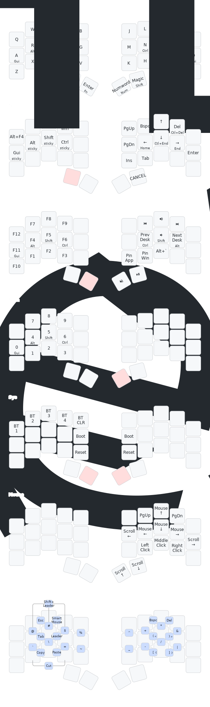

# My ZMK Config

Personal [ZMK firmware](https://github.com/zmkfirmware/zmk/) configuration based on [urob's zmk-config](https://github.com/urob/zmk-config). See urob's repository for detailed documentation on the keymap features, homerow mods configuration, and local build environment setup.

## Changes from upstream

This fork is customized for:

- **Temper keyboard** - Added shield configuration for the Temper split keyboard with nice!view displays
- **macOS shortcuts** - Navigation cluster uses macOS-style shortcuts (Cmd+arrows for line/document navigation, Option+Backspace/Delete for word deletion)
- **Unicode input** - Configured for macOS unicode input mode
- **Simplified Magic Shift** - Removed repeat key functionality; tap for sticky shift, double-tap for caps word, hold for regular shift

## Keymap

## Building

Firmware builds automatically via GitHub Actions on push. See [build.yaml](build.yaml) for configured targets.

For local builds, see the [local build environment](https://github.com/urob/zmk-config#local-build-environment) instructions in urob's repo.
